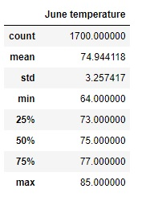
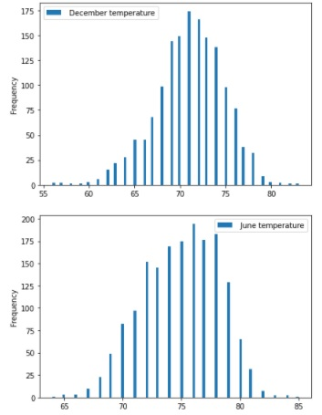

# surfs_up

## Overview
W. Avy wants temperature data for the months of June and December in Oahu (HI), to determine if his surf and ice cream shop business would be sustainable year-round.

## Results
We can observe three main differences between the june and december temperature in Oahu. 

1- On average, it's hotter in june than it is in december (74.94 degrees vs 71.04 degrees)

2- There is more weather variation in december than in june (std= 3.76 vs std= 3.26)

3- The lowest temperature you can expect in December is 56 degrees, compared to a 64 degrees in June. 

For more details, you might want to refer to the tables below.

## Summary
With those kind of results, an ice cream shop can be profitable. People usually enjoy eating ice cream between 70 and 75 degrees. However, W.Avy might want some more details about the weather. For example, he should ask about the rain or even the wind. If it's usually raining or windy, an ice cream shop will not be profitable. People won't go to the beach and spend on ice cream or surf equipment. W.Avy could also be interested in the weather frequency during the months of june and december. Luckily, we have done it for him (See the image below). 

W.Avy can observe that the vast majority of june days are between 70 and 79 degrees. In december, it's more between 67 and 76 degrees. 
